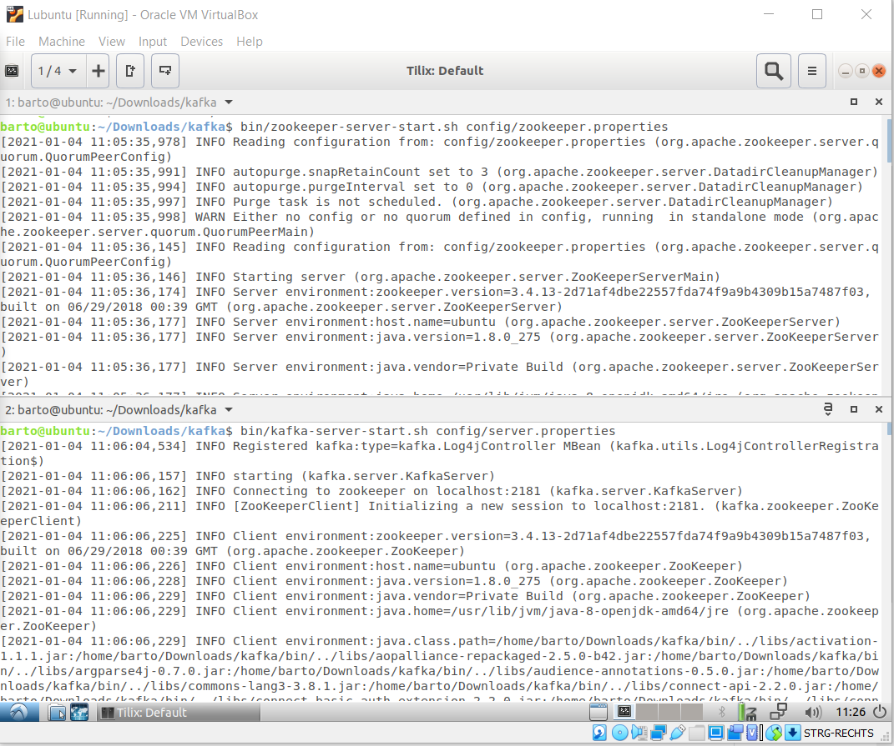
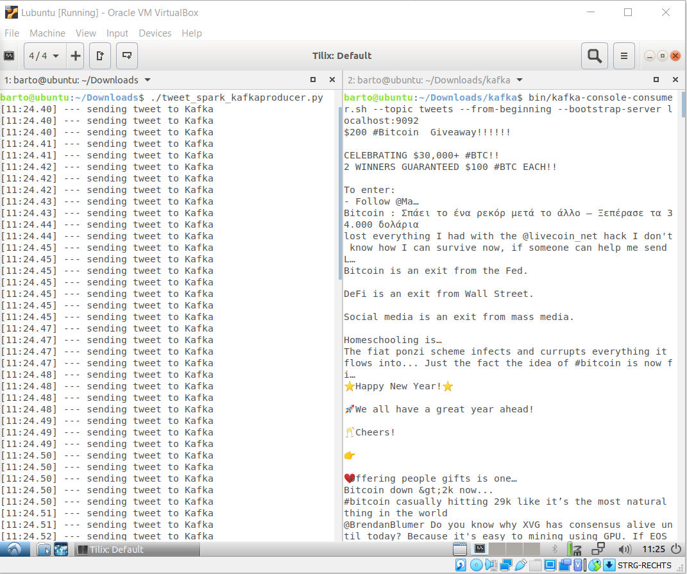
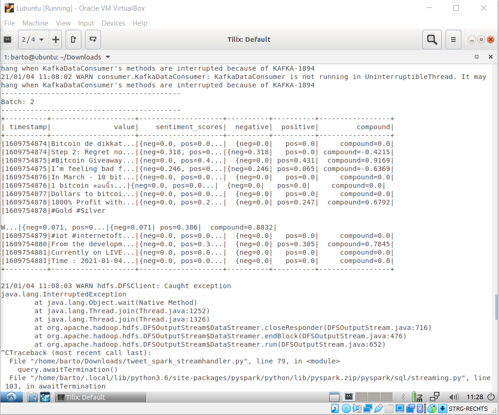

# Kafka & Spark Structured Streaming Sentiment Analysis on a Virtual Machine with lubuntu
   

A nice project with Streaming Data. It comes from Twitter API, goes through Kafka to Spark where a sentiment analysis with NLTK Vader is done. For the moment the writing of fata is to Console, but maybe I will expend it to an graphical up-to-date presentation in Dash.
```
Twitter --> Kafka --> Spark
```
## Let's start
**1. Start the Kafka Environment**

NOTE: Your local environment must have Java 8+ installed.

Run the following commands in order to start all services in the correct order:

--Start the ZooKeeper service
---Note: Soon, ZooKeeper will no longer be required by Apache Kafka.
```
bin/zookeeper-server-start.sh config/zookeeper.properties
```
Open another terminal session and run:

--Start the Kafka broker service
```
bin/kafka-server-start.sh config/server.properties
```
**2. Create a topic called: tweets**

Open another terminal session and run:
```
bin/kafka-topics.sh --create --bootstrap-server localhost:9092 --replication-factor 1 --partitions 1 --topic tweets
```
Check if it worked well:
```
bin/kafka-topics.sh --list --bootstrap-server localhost:9092
```
**3. Start the Producer**

Open another terminal session and run:
```
./tweet_spark_kafkaproducer.py
```
**4. Start the Consumer**

Open another terminal session and run:
```
bin/kafka-console-consumer.sh --topic tweets --from-beginning --bootstrap-server localhost:9092
```
**5. Start Spark**

Open another terminal session and run:
```
spark-submit --packages org.apache.spark:spark-sql-kafka-0-10_2.12:3.0.1 tweet_spark_streamhandler.py
```
**NOTE:**
Sometimes if you run Spark there will flop some errors. Mostly they have something to do with hadoops clusters. If it will be the case try to "reset" the cluster with following commands:

Stop Spark and Kafka producer first.
Run separatly:
```
cd hadoop/etc/hadoop

stop-all.sh 
hadoop namenode -format
start-all.sh
```
After that start kafka Producer and Spark one more time.
